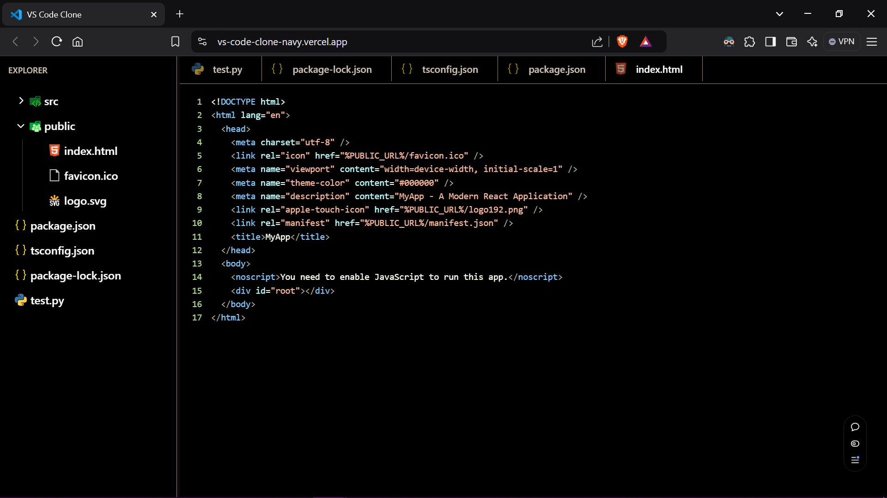

# VS Code Clone

A Visual Studio Code clone built with React, Redux, and TypeScript. This project aims to replicate the core functionality and user interface of Visual Studio Code in a web application.



🔗 **Live Demo**: [https://vs-code-clone-navy.vercel.app/](https://vs-code-clone-navy.vercel.app/)

## Table of Contents

- [VS Code Clone](#vs-code-clone)
  - [Table of Contents](#table-of-contents)
  - [Features](#features)
  - [Technologies Used](#technologies-used)
  - [Getting Started](#getting-started)
    - [Prerequisites](#prerequisites)
    - [Installation](#installation)
  - [Available Scripts](#available-scripts)
  - [Usage](#usage)
  - [Customization](#customization)
    - [Theme Customization](#theme-customization)
    - [Adding Language Support](#adding-language-support)
  - [Contributing](#contributing)
  - [Testing](#testing)
    - [Test Coverage](#test-coverage)
  - [Deployment](#deployment)
    - [Vercel Deployment](#vercel-deployment)
  - [License](#license)
  - [Acknowledgements](#acknowledgements)
  - [Contact](#contact)

## Features

- File Explorer sidebar with expandable folders and files
- Tabbed interface for open files
- Syntax highlighting for various programming languages
- Resizable panels using react-resizable-panels
- Welcome screen when no files are open
- Redux state management for file tree and tabs
- Responsive design with custom scrollbars
- Dark theme inspired by VS Code's default dark theme

## Technologies Used

- Vite
- React 18
- Redux Toolkit
- TypeScript
- Tailwind CSS
- react-resizable-panels
- Fira Code font for editor text

## Getting Started

### Prerequisites

- Node.js (version 14 or later recommended)
- npm or yarn

### Installation

1. Clone the repository

   ```bash
   git clone https://github.com/ahmednasser111/vs-code-clone
   ```

2. Navigate to the project directory

   ```bash
   cd vs-code-clone
   ```

3. Install dependencies
   ```bash
   npm install
   # or
   yarn install
   ```

## Available Scripts

In the project directory, you can run:

- `npm run dev` or `yarn dev`

  - Runs the app in development mode using Vite
  - Open [http://localhost:5173](http://localhost:5173) to view in browser

- `npm run build` or `yarn build`

  - Builds the app for production using Vite
  - Outputs to the `dist` folder

- `npm run preview` or `yarn preview`

  - Locally preview production build with Vite

## Usage

1. Start the development server

   ```bash
   npm run dev
   ```

2. Open your browser and navigate to `http://localhost:5173`

3. Explore the VS Code-like interface:
   - Use the file explorer sidebar
   - Open files by clicking
   - Resize panels
   - Enjoy syntax highlighting

## Customization

### Theme Customization

- Modify `src/index.css` for global styles
- Adjust Tailwind configuration in `tailwind.config.js`

### Adding Language Support

- Update `src/constants/languageMap.ts` to add new language syntax highlighting

## Contributing

1. Fork the repository
2. Create your feature branch (`git checkout -b feature/AmazingFeature`)
3. Commit your changes (`git commit -m 'Add some AmazingFeature'`)
4. Push to the branch (`git push origin feature/AmazingFeature`)
5. Open a Pull Request

## Testing

Run the test suite:

```bash
npm run test
# or
yarn test
```

### Test Coverage

- Component rendering
- Redux store logic
- File handling interactions

## Deployment

### Vercel Deployment

- **Live URL**: [https://vs-code-clone-navy.vercel.app/](https://vs-code-clone-navy.vercel.app/)
- Automatically deployed from the main branch
- Build settings:
  - Framework Preset: Vite
  - Build Command: `npm run build`
  - Output Directory: `dist`

## License

Distributed under the MIT License.

## Acknowledgements

- [Vite](https://vitejs.dev/)
- [React](https://reactjs.org/)
- [Redux Toolkit](https://redux-toolkit.js.org/)
- [Tailwind CSS](https://tailwindcss.com/)

## Contact

Your Name - [ahmednaser7707@gmail.com](mailto:ahmednaser7707@gmail.com)

Project Link: [hhttps://github.com/ahmednasser111/vs-code-clone](https://github.com/ahmednasser111/vs-code-clone)

---

**Note**: This is a clone project for learning purposes. Visual Studio Code is a product of Microsoft, and this project is not affiliated with or endorsed by Microsoft.
